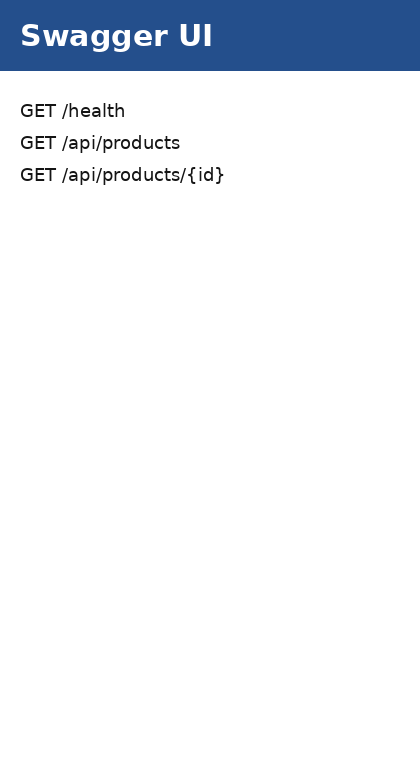
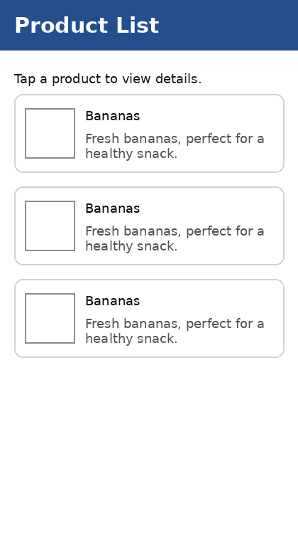
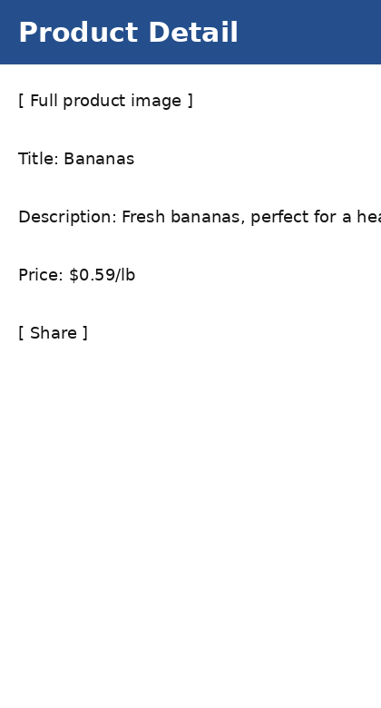

# Meijer Product Information Solution

This solution implements the Meijer take-home assessment with:

- ASP.NET Core 8 Product API
- Swagger/OpenAPI documentation
- .NET 8 MAUI Android mobile app
- MVVM pattern
- Product list screen
- Product detail screen
- Add to list / share functionality
- Location-based city lookup
- Loading indicators and error states
- Product-list caching in the API and mobile app
- JSON sample-data mode for local testing
- MS SQL Server mode for production-style persistence
- Docker support
- Kubernetes deployment files
- xUnit API repository tests

The API uses the provided sample JSON files:

- `ProductInfo.Api/Data/products.json`
- `ProductInfo.Api/Data/product-details.json`

---

## Solution structure

```text
MeijerProductSolution_Official/
  MeijerProductSolution.sln
  NuGet.Config
  docker-compose.yml
  .dockerignore

  ProductInfo.Api/
    Dockerfile
    Program.cs
    appsettings.json
    Data/
      products.json
      product-details.json
      ProductDbContext.cs
    Dtos/
    Models/
    Repositories/
      IProductRepository.cs
      JsonProductRepository.cs
      SqlProductRepository.cs
    Services/
      IProductService.cs
      ProductService.cs
      JsonSeedDataService.cs

  ProductInfo.Mobile/
    App.xaml
    AppShell.xaml
    MauiProgram.cs
    Platforms/Android/
      MainActivity.cs
      MainApplication.cs
      AndroidManifest.xml
    Models/
    Services/
    ViewModels/
    Views/

  ProductInfo.Api.Tests/
    JsonProductRepositoryTests.cs

  deploy/k8s/
    namespace.yaml
    api-configmap.yaml
    api-deployment.yaml
    api-service.yaml
    api-nodeport-service.yaml
    api-hpa.yaml
    sqlserver-secret.yaml
    sqlserver-deployment.yaml
    sqlserver-service.yaml
    api-configmap-sqlserver.yaml

  docs/screenshots/
    swagger.png
    product-list.png
    product-detail.png
```

---

## Prerequisites

Install these before running locally:

- Visual Studio 2022
- .NET 8 SDK
- .NET MAUI workload
- Android emulator from Android Device Manager
- Docker Desktop, only if using Docker
- Kubernetes cluster, only if using Kubernetes, such as Docker Desktop Kubernetes or Minikube

Check MAUI workload:

```cmd
dotnet workload list
```

Install MAUI workload if missing:

```cmd
dotnet workload install maui
```

For Android MAX_PATH issues, extract the solution to a short path:

```text
C:\src\MeijerProductSolution
```

---

## Run the API locally with JSON sample data

Open a terminal from the solution root:

```cmd
cd C:\src\MeijerProductSolution
```

Run the API:

```cmd
dotnet run --project ProductInfo.Api
```

Swagger:

```text
http://localhost:5000/swagger
```

Health check:

```text
http://localhost:5000/health
```

Product endpoints:

```http
GET http://localhost:5000/api/products
GET http://localhost:5000/api/products/0
```

Default data provider is JSON:

```json
"DataSource": {
  "Provider": "Json"
}
```

---

## Run the MAUI Android app

1. Start the API first:

   ```cmd
   dotnet run --project ProductInfo.Api
   ```

2. Open `MeijerProductSolution.sln` in Visual Studio.
3. Right-click `ProductInfo.Mobile` → **Set as Startup Project**.
4. Start an Android emulator from **Tools → Android → Android Device Manager**.
5. Select the emulator in the Visual Studio run target dropdown.
6. Press **F5**.

The Android emulator cannot call your PC API with `localhost`. The mobile app already handles this:

```text
Android emulator API base URL: http://10.0.2.2:5000
Windows/local API base URL:     http://localhost:5000
```

If Visual Studio deploys but does not launch the app automatically, launch it manually:

```powershell
cd "C:\Program Files (x86)\Android\android-sdk\platform-tools"
.\adb.exe shell monkey -p com.companyname.productinfo -c android.intent.category.LAUNCHER 1
```

---

## Visual Studio launcher activity fix

`ProductInfo.Mobile/Platforms/Android/MainActivity.cs` is configured with:

```csharp
[Activity(
    Theme = "@style/Maui.SplashTheme",
    MainLauncher = true,
    LaunchMode = LaunchMode.SingleTop,
    ConfigurationChanges =
        ConfigChanges.ScreenSize |
        ConfigChanges.Orientation |
        ConfigChanges.UiMode |
        ConfigChanges.ScreenLayout |
        ConfigChanges.SmallestScreenSize |
        ConfigChanges.Density)]
public class MainActivity : MauiAppCompatActivity
{
}
```

The important property is:

```csharp
MainLauncher = true
```

If the old app is cached on the emulator, uninstall it:

```powershell
cd "C:\Program Files (x86)\Android\android-sdk\platform-tools"
.\adb.exe uninstall com.companyname.productinfo
```

Then clean, rebuild, and deploy again.

---

## API data-source modes

The API supports two data providers.

### JSON mode

Use this for local testing and assessment demo:

```json
"DataSource": {
  "Provider": "Json",
  "AutoMigrate": false
}
```

JSON mode reads:

```text
ProductInfo.Api/Data/products.json
ProductInfo.Api/Data/product-details.json
```

### SQL Server mode

Use this for production-style persistence:

```json
"DataSource": {
  "Provider": "SqlServer",
  "AutoMigrate": true
},
"ConnectionStrings": {
  "ProductDb": "Server=localhost,1433;Database=ProductInfoDb;User Id=sa;Password=Your_strong_password123;TrustServerCertificate=True;MultipleActiveResultSets=True"
}
```

When SQL Server mode is enabled, the API uses:

```text
ProductDbContext
SqlProductRepository
JsonSeedDataService
```

`JsonSeedDataService` seeds the SQL database from `product-details.json` if the product table is empty.

---

## Entity Framework commands

Install EF tool if needed:

```cmd
dotnet tool install --global dotnet-ef
```

Create migration:

```cmd
dotnet ef migrations add InitialCreate --project ProductInfo.Api
```

Update database:

```cmd
dotnet ef database update --project ProductInfo.Api
```

---

## Run unit tests

From the solution root:

```cmd
dotnet test
```

Included tests verify:

- Product summaries are loaded from JSON.
- Product detail is returned for an existing product.
- Product detail returns null for a missing product.

---

## Docker: run API with JSON data

From the solution root:

```cmd
docker compose up --build productinfo-api
```

Swagger:

```text
http://localhost:5000/swagger
```

Products:

```text
http://localhost:5000/api/products
```

Stop:

```cmd
docker compose down
```

---

## Docker: run API with SQL Server

This starts SQL Server and the API with SQL provider enabled:

```cmd
docker compose --profile sql up --build
```

API with SQL mode:

```text
http://localhost:5001/swagger
http://localhost:5001/api/products
```

SQL Server connection from host:

```text
Server=localhost,1433
Database=ProductInfoDb
User Id=sa
Password=Your_strong_password123
TrustServerCertificate=True
```

Stop containers but keep SQL volume:

```cmd
docker compose --profile sql down
```

Stop and remove SQL volume:

```cmd
docker compose --profile sql down -v
```

---

## Build Docker image manually

```cmd
docker build -f ProductInfo.Api/Dockerfile -t productinfo-api:latest .
```

Run manually:

```cmd
docker run --rm -p 5000:5000 -e DataSource__Provider=Json productinfo-api:latest
```

---

## Kubernetes deployment with JSON data

Build the API image first:

```cmd
docker build -f ProductInfo.Api/Dockerfile -t productinfo-api:latest .
```

If using Minikube, load the image:

```cmd
minikube image load productinfo-api:latest
```

Apply Kubernetes manifests:

```cmd
kubectl apply -f deploy/k8s/namespace.yaml
kubectl apply -f deploy/k8s/api-configmap.yaml
kubectl apply -f deploy/k8s/api-deployment.yaml
kubectl apply -f deploy/k8s/api-service.yaml
kubectl apply -f deploy/k8s/api-nodeport-service.yaml
kubectl apply -f deploy/k8s/api-hpa.yaml
```

Check pods:

```cmd
kubectl get pods -n productinfo
```

Port-forward the API:

```cmd
kubectl port-forward svc/productinfo-api 5000:5000 -n productinfo
```

Open:

```text
http://localhost:5000/swagger
```

If using the NodePort service:

```text
http://localhost:30500/swagger
```

---

## Kubernetes deployment with SQL Server

Apply namespace and SQL resources:

```cmd
kubectl apply -f deploy/k8s/namespace.yaml
kubectl apply -f deploy/k8s/sqlserver-secret.yaml
kubectl apply -f deploy/k8s/sqlserver-deployment.yaml
kubectl apply -f deploy/k8s/sqlserver-service.yaml
```

Switch API config to SQL Server:

```cmd
kubectl apply -f deploy/k8s/api-configmap-sqlserver.yaml
kubectl apply -f deploy/k8s/api-deployment.yaml
kubectl apply -f deploy/k8s/api-service.yaml
```

Restart API pods if needed:

```cmd
kubectl rollout restart deployment/productinfo-api -n productinfo
```

Port-forward:

```cmd
kubectl port-forward svc/productinfo-api 5000:5000 -n productinfo
```

Open:

```text
http://localhost:5000/swagger
```

Note: the included SQL Server Kubernetes manifest uses `emptyDir` for simple local demos. For production, replace it with a PersistentVolumeClaim and store secrets in a real secret manager.

---

## Screenshots

### Swagger API



### Product list



### Product detail



---

## Troubleshooting

### API is running but emulator cannot load products

Use this URL from Android emulator:

```text
http://10.0.2.2:5000
```

Do not use `localhost` inside the Android emulator.

### Deployment succeeds but app does not launch

Run:

```powershell
cd "C:\Program Files (x86)\Android\android-sdk\platform-tools"
.\adb.exe shell pm list packages | findstr product
.\adb.exe shell monkey -p com.companyname.productinfo -c android.intent.category.LAUNCHER 1
```

### MAX_PATH build error

Extract to a shorter path:

```text
C:\src\MeijerProductSolution
```

### API exe locked during rebuild

End the running API process in Task Manager or run:

```cmd
taskkill /IM ProductInfo.Api.exe /F
```

### NuGet package restore fails

Make sure `NuGet.Config` includes nuget.org and Visual Studio is not limited to offline sources.

---

## Assessment requirement mapping

| Requirement | Implementation |
|---|---|
| Product API | `GET /api/products` |
| Product Detail API | `GET /api/products/{id}` |
| Persistence layer | JSON repository and SQL Server repository |
| API best practices | DI, repository/service layers, Swagger, health check, error handling |
| Product list UI | `ProductListPage` with `CollectionView` |
| Product detail UI | `ProductDetailPage` |
| Add to list/share | MAUI `Share.Default.RequestAsync` |
| City from current location | MAUI `Geolocation` and `Geocoding` |
| Loading indicator | `ActivityIndicator` bound to `IsBusy` |
| Error handling | ViewModel error messages and retry support |
| Caching | API `IMemoryCache` and mobile in-memory cache |
| Unit tests | `ProductInfo.Api.Tests` |
| Docker | `ProductInfo.Api/Dockerfile` and `docker-compose.yml` |
| Kubernetes | `deploy/k8s/*.yaml` |
